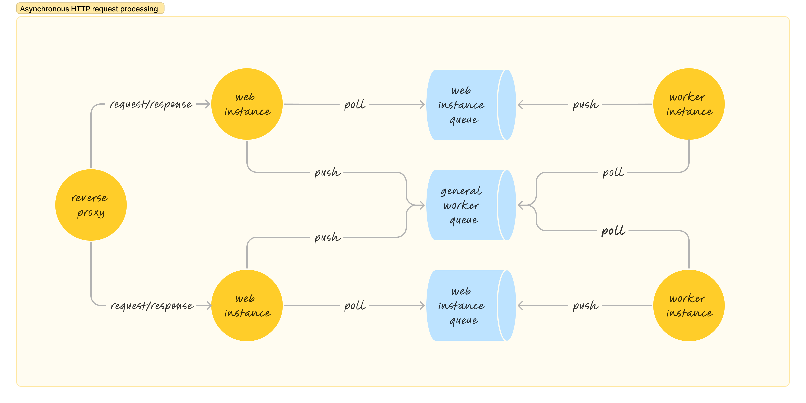

# Асинхронная обработка HTTP запроса



# Как запустить?

```shell
docker-compose up --build
```

Открыть в браузере [http://localhost:8080](http://localhost:8080)

# Как удалить?

```shell
docker-compose down --rmi --volumes
```
